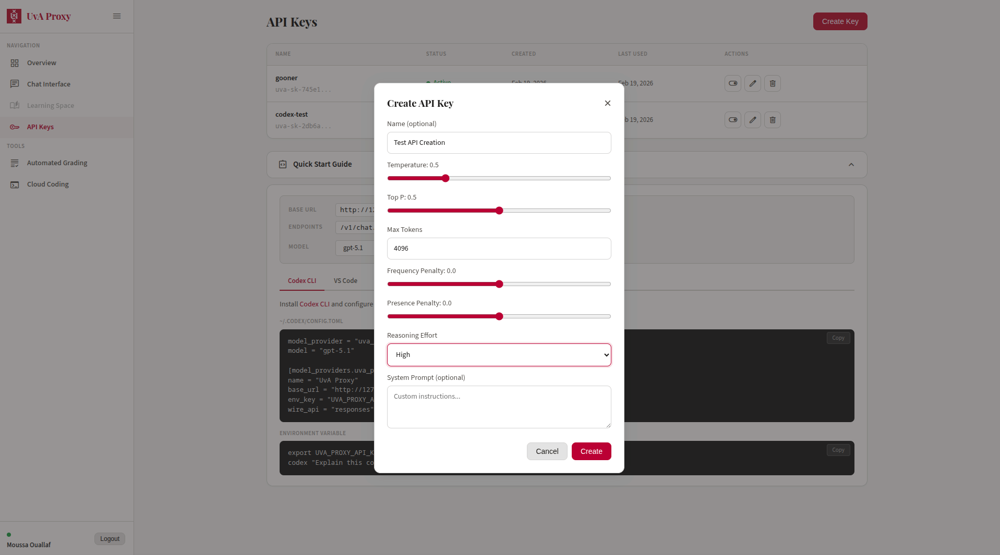
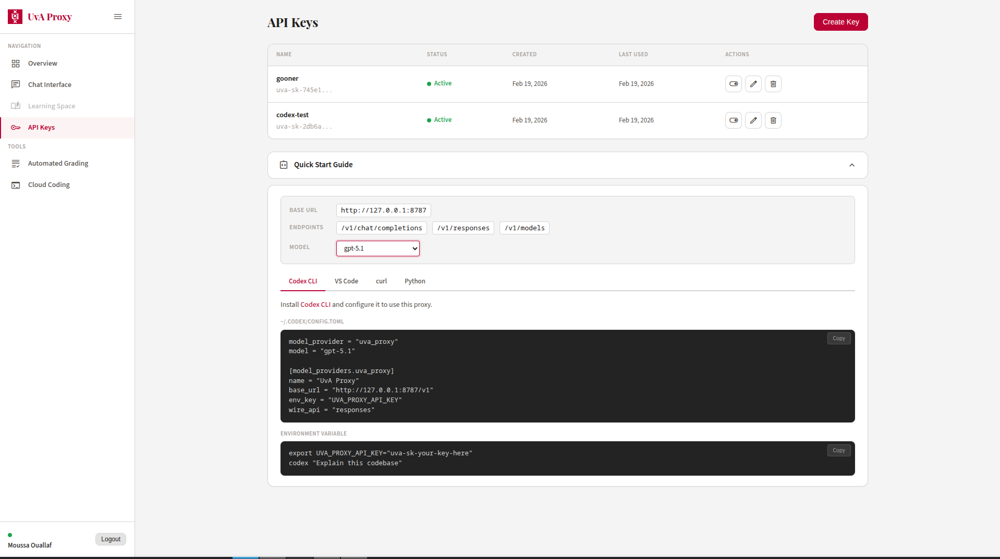
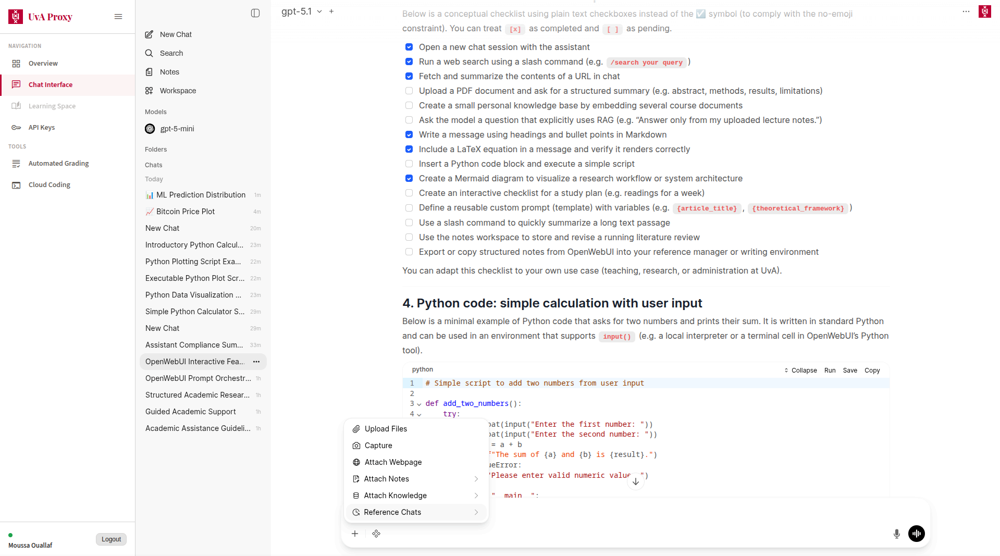
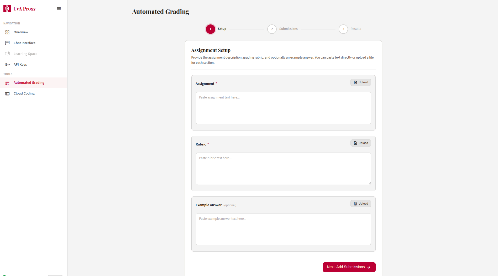
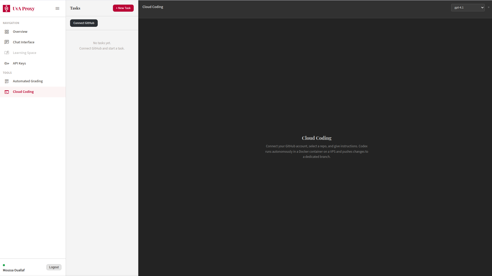
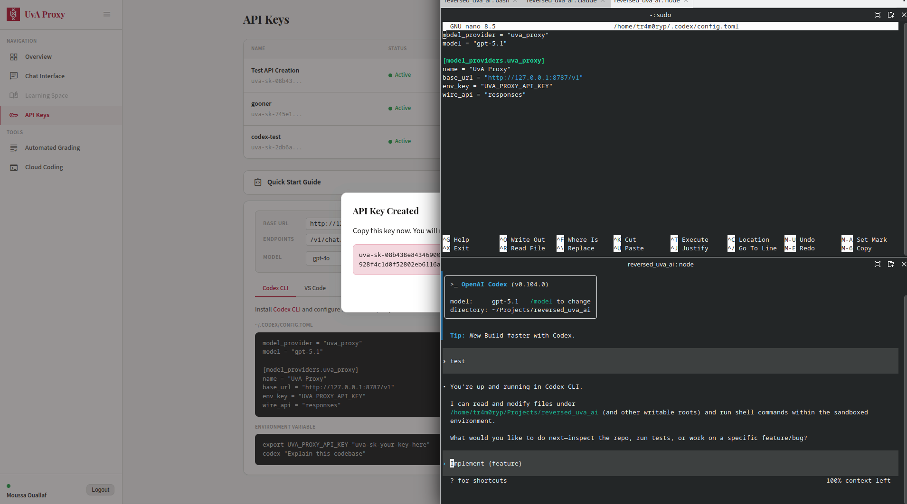

# UvA AI V2

A reverse-engineered local proxy for UvA's AI Chat platform ([aichat.uva.nl](https://aichat.uva.nl)). Unlocks the full potential of the university's AI infrastructure by providing an OpenAI-compatible API, a better chat interface, cloud coding capabilities, automated assignment grading, and more -- all powered by models UvA already pays for but restricts behind a basic web UI.

## Why this exists

UvA gives students and staff access to GPT-5, GPT-4.1, and other models, but locks them behind a minimal chat interface with no API access, no tool integration, no coding support, and no way to use them with external tools. This project changes that.

By reverse-engineering the platform's internal API (via publicly exposed Next.js source maps), we built a full proxy layer written in C that speaks the OpenAI API standard. This means every tool in the OpenAI ecosystem -- Claude Code, Codex CLI, Cursor, Continue, GitHub Copilot, and any OpenAI SDK client -- works with UvA's models out of the box.

## Features

### API Key Management

Self-service key management with security built in.

- **SHA-256 hashed storage** -- Raw keys are never stored. The key is shown exactly once at creation time, then only the hash is kept.
- **Per-key defaults** -- Each key carries its own model, temperature, max tokens, system prompt, and reasoning effort. These are used when the API request doesn't specify overrides.
- **Enable / disable** -- Toggle keys on and off without deleting them. Useful for rotating keys or temporarily revoking access.
- **Usage audit** -- Every request is logged with the API key ID, model used, input/output character counts, latency, and success status.

#### Creating a new key

Click **New Key** in the dashboard, give it a name, pick a default model and optionally a system prompt or temperature override. The raw key is displayed once -- copy it before closing.



#### Managing existing keys

The keys overview shows every key with its creation date, last-used model, total request count, and toggle to enable or disable it. Click any key to drill into per-day usage stats.



### OpenAI-Compatible API

A drop-in replacement for the OpenAI API. Point any tool at your proxy URL and it just works.

- **Chat Completions** (`/v1/chat/completions`) -- Streaming SSE responses in standard OpenAI format. Supports system prompts, multi-turn conversations, temperature control, and token limits.
- **Responses API** (`/v1/responses`) -- Full implementation of OpenAI's Responses API with tool-call support and multi-turn state persistence. Enables agentic workflows where the model can call functions, receive results, and continue reasoning.
- **Model listing** (`/v1/models`) -- Standard model enumeration endpoint.
- **7 models available**, including ones hidden from the default UvA chat UI:
  - GPT-5, GPT-5.1, GPT-5 Mini, GPT-5 Nano
  - GPT-4.1, GPT-4o
  - GPT OSS 120B (open-source 120B parameter model)

### Improved Chat Interface

A clean, modern dashboard that improves on UvA's default chat experience.

- **Dashboard overview** -- At-a-glance stats showing your API keys, active keys, and available models.
- **Per-key configuration** -- Create multiple API keys, each with its own default model, temperature, max tokens, system prompt, and reasoning effort. Use different configs for different tasks (one key for coding with GPT-5, another for quick questions with GPT-5 Nano).
- **Usage analytics** -- Per-key metrics: total requests, success rate, average latency, output character volume, and a 14-day daily breakdown table. Know exactly how you're using the platform.
- **Model access** -- Browse and select from all available models, including ones UvA doesn't surface in their chat UI.
- **Runnable code blocks** -- Code in AI responses can be executed directly in the interface. Task selection lets you choose between different coding, analysis, and reasoning tasks without leaving the chat.



### Automated Assignment Grading

Built-in grading workflow for batch-processing student submissions with AI. Upload a rubric, paste in student submissions, and let any available model grade them in batch.

- **Session management** -- Create, track, and manage grading sessions from the dashboard. Each session tracks submission count, results, and timestamps.
- **Results storage** -- Grading results are stored as structured JSON in the local SQLite database, making them easy to export, query, and analyze.
- **Submission tracking** -- Track the number of submissions processed per session with full audit history.
- **Graded by GPT-5.1** -- Submissions are evaluated using GPT-5.1, which offers strong instruction-following and rubric adherence.



### Automatic Cookie Sync

A background thread inside the proxy watches your local Chrome and Firefox cookie databases and automatically picks up a fresh session token whenever you log into UvA.

- **Polling monitor** -- Reads the Chrome/Firefox SQLite cookie database directly from the filesystem every 2 seconds. No browser extension required.
- **Multi-browser support** -- Works with Google Chrome, Chromium, and Firefox on Linux and macOS.
- **Validation** -- Each detected cookie is validated against UvA's upstream API before being applied, so stale or partial cookies are ignored.
- **Auto-login flow** -- Running `./uva-proxy --login` opens a browser window pointing at `aichat.uva.nl`. Once you log in, the proxy captures the session cookie automatically and writes it to `proxy.env`.

### Cloud Coding *(work in progress)*

Use UvA's models as your coding backbone -- locally or in the cloud.

- **Claude Code compatible** -- The Responses API implements the exact protocol Claude Code expects, including streaming tool calls and `previous_response_id` chaining. Run `claude --model gpt-5` and get full agentic coding with file edits, terminal commands, and multi-step reasoning, all powered by UvA's GPT-5.
- **Codex CLI compatible** -- Works as a drop-in backend for OpenAI's Codex CLI. Set `OPENAI_BASE_URL` to your proxy and code away.
- **opencode built-in** -- The project ships with opencode pre-configured. After `./start.sh`, open http://127.0.0.1:5174 for a full browser-based coding assistant connected to GPT-5.
- **Cursor / Continue / Copilot** -- Any IDE extension that supports custom OpenAI endpoints works with a single config change.
- **Tool use / function calling** -- The proxy translates OpenAI tool definitions into XML system prompts that the model understands, then parses `<tool_call>` blocks from model output back into structured function call objects. This is what makes agentic coding possible -- the model can read files, run commands, and edit code through tool calls.



## How it was built

The entire project was built by reverse-engineering UvA's AI Chat frontend:

1. **Source map extraction** -- UvA's Next.js deployment ships public source maps at `/_next/static/chunks/{hash}.js.map`. The original TypeScript source was recovered from these maps, revealing the full API surface, server action IDs, request formats, and authentication flow.

2. **Request format discovery** -- The upstream platform uses Vercel AI SDK v2 with a custom SSE format (`{"type":"text-delta","delta":"..."}`). Each request requires fresh UUID v4 identifiers for both the thread and message. The proxy generates these automatically.

3. **Authentication chain** -- Users authenticate via Azure AD (UvA's SSO). The session cookie from `aichat.uva.nl` (`__Secure-next-auth.session-token`) is stored in `proxy.env` and injected into every upstream request. The proxy monitors cookie expiry and can re-authenticate automatically.

4. **Translation layer** -- The proxy translates bidirectionally between OpenAI and UvA formats:
   - OpenAI `messages` array becomes UvA's `{id, message, flags, overrides}` structure
   - UvA's `text-delta` SSE events become OpenAI's `choices[0].delta.content` format
   - Tool definitions become XML system prompts; XML tool-call blocks in output become OpenAI function call objects

5. **State persistence** -- Multi-turn Responses API conversations are persisted in a local SQLite database with a 2-hour TTL, supporting `previous_response_id` chaining that matches OpenAI's stateful conversation model.

## Architecture

```
User / External Tool
    |
    |  Standard OpenAI API  (Bearer key auth)
    v
+--------------------------------------+
|  uva-proxy  (C, port 8787)           |
|                                      |
|  Translates formats                  |
|  Manages API keys (SQLite)           |
|  Tracks usage / analytics            |
|  Handles tool calls                  |
|  Persists Responses API state        |
|  Serves dashboard UI                 |
+--------------------------------------+
    |
    |  UvA internal format + session cookies
    v
+--------------------------------------+
|  aichat.uva.nl                       |
|  (UvA's Next.js AI platform)         |
|                                      |
|  GPT-5, GPT-4.1, GPT-4o, ...        |
+--------------------------------------+
    |
    |  Vercel AI SDK v2 SSE stream
    v
Proxy translates back -> OpenAI SSE format -> Tool
```

**Stack:** C99, SQLite3, libcurl, json-c, OpenSSL, pthreads.
**Chat UI:** Open WebUI (vendored submodule, port 8080).
**Cloud coding UI:** opencode-web (vendored submodule, port 5174).
**Coding assistant:** opencode server (port 4096).

## Setup

### Prerequisites

| Tool | Purpose | Install |
|------|---------|---------|
| `gcc` / `make` | Build the C proxy | `sudo apt install build-essential` |
| `libcurl`, `libjson-c`, `libssl` | Proxy dependencies | `sudo apt install libcurl4-openssl-dev libjson-c-dev libssl-dev` |
| `uv` | Python venv (Open WebUI) | auto-installed by `./start.sh` |
| `bun` | opencode-web dev server | auto-installed by `./start.sh` |
| `opencode` | AI coding assistant | auto-installed by `./start.sh` |

### Quick start

```bash
git clone --recurse-submodules https://github.com/tr4m0ryp/UVA_AI_V2.git
cd UVA_AI_V2

# Configure your session cookie (see below for how to get it)
cp proxy/proxy.env.example proxy/proxy.env
$EDITOR proxy/proxy.env

# Start all services (installs missing tools automatically)
./start.sh
```

On first run `./start.sh` will:
- Build the C proxy binary
- Create the Open WebUI Python venv and install dependencies
- Build the Open WebUI frontend
- Install opencode-web dependencies
- Start all four services

Subsequent runs are fast -- nothing is reinstalled if already present.

To reset a running stack and restart cleanly:

```bash
./start.sh --reset
```

### Getting your session cookie

1. Open [https://aichat.uva.nl](https://aichat.uva.nl) in Chrome or Firefox.
2. Log in with your UvA / HvA credentials (Azure AD).
3. Open DevTools (`F12`) → Application → Cookies → `https://aichat.uva.nl`.
4. Copy the **full value** of `__Secure-next-auth.session-token`.
5. Paste it into `proxy/proxy.env`:
   ```
   UVA_SESSION_COOKIE="__Secure-next-auth.session-token=eyJ..."
   ```

Alternatively, run `./proxy/uva-proxy --login` after building -- this opens a browser and captures the cookie automatically.

### Services

| Service | URL | Description |
|---------|-----|-------------|
| Proxy API + dashboard | http://127.0.0.1:8787 | OpenAI-compatible API and management UI |
| Chat interface | http://127.0.0.1:8080 | Open WebUI (full-featured chat) |
| opencode server | http://127.0.0.1:4096 | AI coding assistant backend |
| opencode-web UI | http://127.0.0.1:5174 | Cloud coding web interface |

### Running the proxy only

If you only need the API without the chat UI or coding tools:

```bash
cd proxy
make -j$(nproc)
cp proxy.env.example proxy.env   # fill in your cookie
./uva-proxy --port 8787 --headless
```

### Logs

All service logs are written to `logs/` in the project root:

```
logs/proxy.log
logs/webui.log
logs/opencode.log
logs/opencode-web.log
```

## Usage examples

### Python (OpenAI SDK)

```python
from openai import OpenAI

client = OpenAI(
    base_url="http://127.0.0.1:8787/v1",
    api_key="uva-local",
)

response = client.chat.completions.create(
    model="gpt-5",
    messages=[{"role": "user", "content": "Hello"}],
    stream=True,
)

for chunk in response:
    print(chunk.choices[0].delta.content or "", end="")
```

### curl

```bash
curl http://127.0.0.1:8787/v1/chat/completions \
  -H "Authorization: Bearer uva-local" \
  -H "Content-Type: application/json" \
  -d '{
    "model": "gpt-4o",
    "messages": [{"role": "user", "content": "Hello"}],
    "stream": true
  }'
```

### VS Code / Cursor / Continue

Point any VS Code AI extension at `http://127.0.0.1:8787/v1` with API key `uva-local`. Works with Continue.dev, Cursor, and any extension that accepts a custom OpenAI-compatible base URL.

### Claude Code (cloud coding)

```bash
export OPENAI_BASE_URL=http://127.0.0.1:8787/v1
export OPENAI_API_KEY=uva-local

claude --model gpt-5
```

Full agentic coding: file reads, edits, terminal commands, multi-step reasoning -- all through UvA's GPT-5.

### OpenAI Codex CLI

```bash
export OPENAI_BASE_URL=http://127.0.0.1:8787/v1
export OPENAI_API_KEY=uva-local

codex
```



### opencode (built-in)

opencode is pre-configured via `opencode.json` in the project root. After `./start.sh`, open http://127.0.0.1:5174 and start coding.

## API reference

All endpoints are served by `uva-proxy` on port `8787`.

| Method | Path | Description |
|--------|------|-------------|
| `POST` | `/v1/chat/completions` | OpenAI-compatible streaming chat completions |
| `POST` | `/v1/responses` | Responses API with tool-call and multi-turn support |
| `GET` | `/v1/models` | List all available models |
| `GET` | `/health` | Health check |
| `*` | `/dashboard/` | Web dashboard (HTML/CSS/JS) |
| `*` | `/api/dashboard/…` | Dashboard REST API (keys, users, grading, etc.) |

